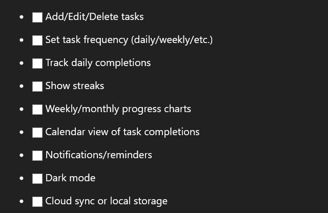

# Track Me

# To-Do List

May 15, 2025 

Today I am creating a to-do list. While I've created one before, this time I want to take it to the next level by making it track my habits and display charts. 

I'm planning everything step by step first to minimize wasted time during development.

To complete this project, I will be using the agile framework

# 🔁What is Agile (Quick Overview)

Agile is a flexible, iterative project management method. You break your work into small chunks called **"Sprints"** (usually 1-2 weeks). After each sprint, you reflect, improve, and move forward.

### Agile Core Ideas:

- **Iterative development:** Build in small pieces.
- **User-focused:** Focus on what a user needs.
- **Frequent feedback loops:** Improve continuously.
- **Working software > perfect documentation** (but still some documentation).

*Building a personal to-do list app that tracks my habits over time and visualizes them through charts to build consistency.*

### 2. 👤 **Target User**

Who is the user of this app?

- Me
- Others ( Personal Members )

### 3. 📋 **Core Features (Initial Brain Dump)**



## Sprint 1 - making a simple to do list

# Making a to do list

finding the problem in below code


I think the problem is the second portion is not  getting rendered properly 

### Issues:

1. **Use of `useEffect`**: You're calling `addTask()` inside `useEffect` on the first render, which adds an initial empty task. You likely want this to happen when the user adds a task, not on initial render.
2. **Rendering the `taskList`**: The `map` function inside the `ul` element should return the JSX. Right now, you're using parentheses without returning anything, which is causing it not to render the tasks.


this is also wrong 


error : 


# Enter key support How to use


- Second mistake I did was trying access .length  without making it an array

# Checked box

The checked attribute in React is used with <input> elements of type "checkbox" or "radio" to control whether the component is selected or not. 

It's a boolean attribute, accepting true or false values. When checked is set to true, the checkbox or radio button will appear selected. When set to false or omitted, it will appear unselected.

In React, managing the checked attribute is crucial for building controlled components. A controlled component is one where React manages the form data. 

To use the checked attribute effectively, it's often paired with an onChange event handler to update the component's state when the user interacts with it.

## 🔁 `{taskList.map((task, index) => ( ... ))}`

```jsx
const [compTask, setCompTask] = useState([]);

  const toggleComplete = (index) => {
    if (compTask.includes(index)) {
      setCompTask(compTask.filter((i) => i !== index));
    } else {
      setCompTask([...compTask, index]);
    }

<ul>
        {taskList.map((task, index) => (
          <li key={index}>
            <input
              type="checkbox"
              checked={compTask.includes(index)}
              onChange={() => toggleComplete(index)}
            />
            <span 
            style={{ textDecoration: compTask.includes(index) ? 'line-through' : 'none' }}>
              {task}
            </span>
            <span onClick={() => deleteTask(index)} style={{ cursor: 'pointer', marginLeft: '10px' }}>
              ❌
            </span>
          </li>
        ))}
      </ul>
```

## ✅ `<input type="checkbox" ... />`

This is a checkbox for marking the task as **completed or not**.

- `type="checkbox"` → standard HTML checkbox input.
- `checked={compTask.includes(index)}` →
    
    This sets the checkbox as **checked** if the `index` of this task is in the `compTask` array (which tracks completed tasks).
    
- `onChange={() => toggleComplete(index)}` →
    
    When the checkbox is toggled, it calls `toggleComplete()` with the current task’s index to either **add** or **remove** it from the `compTask` array.
    

---

## 📝 `<span style={...}>{task}</span>`

This displays the task text.

- The `style={{ textDecoration: ... }}` adds a **line-through** effect if the task is marked completed:
    
    ```
    js
    CopyEdit
    compTask.includes(index) ? 'line-through' : 'none'
    
    ```
    
    - If completed → `line-through`
    - If not completed → no decoration

# Checkbox designing


## 🏃 S**print 1 – Minimal To-Do List Core**

> Focus: Get basic task creation, deletion, and completion working.
> 

### Tasks:

- Set up project repository
- Initialize frontend project
- Create basic UI to add/delete tasks
- Store tasks in localStorage or backend (based on preference)
- Mark tasks as completed

- Creating data and time feature


## Deleting From List


Problem with this code there is find it can u ? 

May 21, 2025 

- using shadcn for styling the whole website


- shadcn is not for react + vite atm, atleast that’s what they in their officials docs
- I think react router solution can work for me in their menu
- 


```jsx
 const titleCase = (str) => {
    if ((str === null) || (str === ''))
        return false;
    else
        str = str.toString();

    return str.replace(/\w\S*/g, function (txt) {
        return txt.charAt(0).toUpperCase() +
            txt.substr(1).toLowerCase();
    });
  }
```


## Phase two - making local storage for it
### Note: Using Local Storage for React State Persistence

**Local storage** allows you to save your app's data in the browser, so it remains available even after a page refresh or browser restart. In a React todo app, you can use local storage to persist the tasks list.

---

### How Local Storage Works

- **Saving:** You use `localStorage.setItem(key, value)` to store data. The value must be a string, so objects/arrays are saved using `JSON.stringify`.
- **Loading:** You use `localStorage.getItem(key)` to retrieve data. You convert it back to an object/array using `JSON.parse`.
- **Persistence:** Data in local storage stays until the user clears it or your code removes it.

---

### How to Implement Local Storage in Your App

1. **Load tasks from local storage on app start:**
    
    Use useEffect to check local storage when the component mounts and set the tasks state.
    
2. **Save tasks to local storage whenever they change:**
    
    Use another useEffect that runs whenever tasks changes.
    
    ## **Use localStorage with React Hooks to Set and Get Items**
    
    LocalStorage is a web storage object that allows JavaScript sites and apps to keep key-value pairs in a web browser with no expiration date.

    

    I implemented the LocalStorage and now it seems to be working and FCC Blog and Scrimba about local storage helped me quite a lot in understanding it. 

    

## Phase three - connecting it with calendar

## Making it an extension
